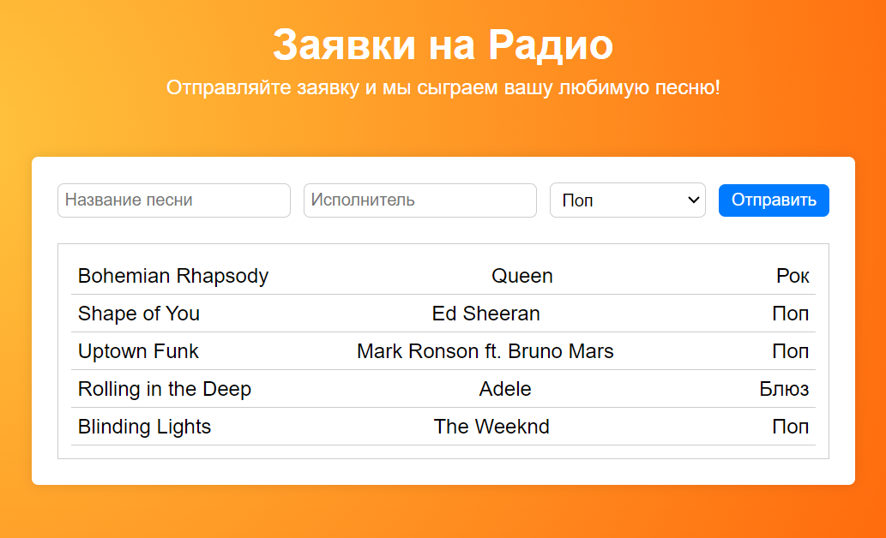

# Приложение: Заявки на Радио

## Цель:

Создать приложение для запросов песен на радио, которое позволит пользователям отправлять заявки на воспроизведение песен. Приложение будет включать форму для ввода деталей песни и отображать список заявленных песен.

Цель этого задания - использовать полученные знания о компонентах, props, state и хендлеров для создания интерактивного приложения с формой и списком.

## Название ветки: `hw-4`

Шаги выполнения домашнего задания:
``
1. Создайте собственную ветку `hw-4` из ветки `master`.
2. Выполните задание.
3. Запушьте свою ветку, предварительно не забыв добавить и описать коммиты.
4. Создайте pull-request в ветку `master` _своего_ репозитория и добавьте `khanmag` в качестве ревьюера (PR не нужно мержить!).
5. **ВАЖНО:** В описание PR добавьте **скриншот запущенного приложения** с выполненным заданием (без скриншота задание не считается сданным).
6. Ссылку на PR (pull-request) добавьте в файл [hw](https://docs.google.com/spreadsheets/d/1EZhKvZKnyOAYc0MXgYjLXoBViDUXsgVwZcqWudazcBo/edit?usp=sharing) комментарием.

## Задание:

1. **Скелет приложения -** Создайте каркас приложения, распределите логику по компонентам
2. **Разбиение по папкам -** Разнесите код компонентов и стилей по файлам. Правильно импортируйте и настройте его.
3. **Добавить логику -** Оживите приложение, чтобы оно работало согласно описанию. Используйте useState, хендлер функции и получение данных из `event` чтобы переносить данные от дочерних компонентов - родительским.

Не забывайте следить за структурой файлов и форматированием вашего кода. Используйте соответствующие комментарии, одинаковые отступы и описательные имена компонентов и переменных.

### Дополнительно (необязательно)

- Добавьте функционал для фильтрации песен по жанру.
- Добавьте функциональность для удаления последней песни из списка.
- Можете изменить стили на ваше усмотрение.

## Советы:

- Используйте деструктуризацию в самом аргументе компонентов: `function MyComponent({ title, artist })`
- Cоблюдайте требования к коммита - см. основной README

Удачи!
