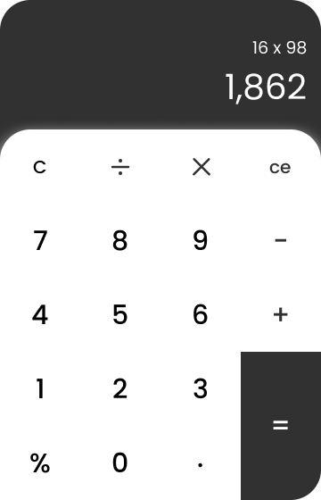

# Приложение: Калькулятор

## Цель:

[макет в figma](https://www.figma.com/file/MDnDs2caQONGF9pRv1uJDy/SimpleCalc?type=design&node-id=0-1&mode=design&t=0adRZegnuIgRe5MQ-0)

Созадать простой вариант калькулятора, на котором можно производить простые арифметические вычисления ( +, -, *, /)

Цель этого задания - использовать полученные знания в реальной задаче.

## Шаги реализации проекта:
``
1. Создайте собственный проект с помощью `Vite`, запуште его в глобальный репозиторий.
2. Аналогично предыдущим дз, создайте ветку для разработки из основной (master или main). Ведите всю работу в ней, не пренебрегая коммитами.
2. Подключите `SCSS` к вашему приложению (в дальнейшем используйте только модули scss).
2. Реализуйте UI прилождения.
4. Создайте pull-request в ветку `master` _своего_ репозитория и добавьте `khanmag` в качестве ревьюера (PR не нужно мержить!).
6. Ссылку на PR (pull-request) добавьте в файл [hw](https://docs.google.com/spreadsheets/d/1EZhKvZKnyOAYc0MXgYjLXoBViDUXsgVwZcqWudazcBo/edit?usp=sharing) комментарием.

## Задание:

1. **Скелет приложения -** Создайте каркас приложения, распределите логику по компонентам
2. **Разбиение по папкам -** Разнесите код компонентов и стилей по файлам. Правильно импортируйте и настройте его.
3. **Добавить логику -** Оживите приложение, чтобы оно работало согласно описанию. Используйте useState, хендлер функции и получение данных из `event` чтобы переносить данные от дочерних компонентов - родительским.

Не забывайте следить за структурой файлов и форматированием вашего кода. Используйте соответствующие комментарии, одинаковые отступы и описательные имена компонентов и переменных.

### Дополнительно (необязательно)

- Реализуйте историю вычислений, чтобы все предыдущие действия отображались на экране выше.
- Опубликуйте ваше приложение на [github pages](https://vitejs.dev/guide/static-deploy.html).

## Советы:

- Разбейте все элементы интерфейса на переиспользуемые компоненты
- Cоблюдайте требования к коммита - см. основной README

Удачи!
