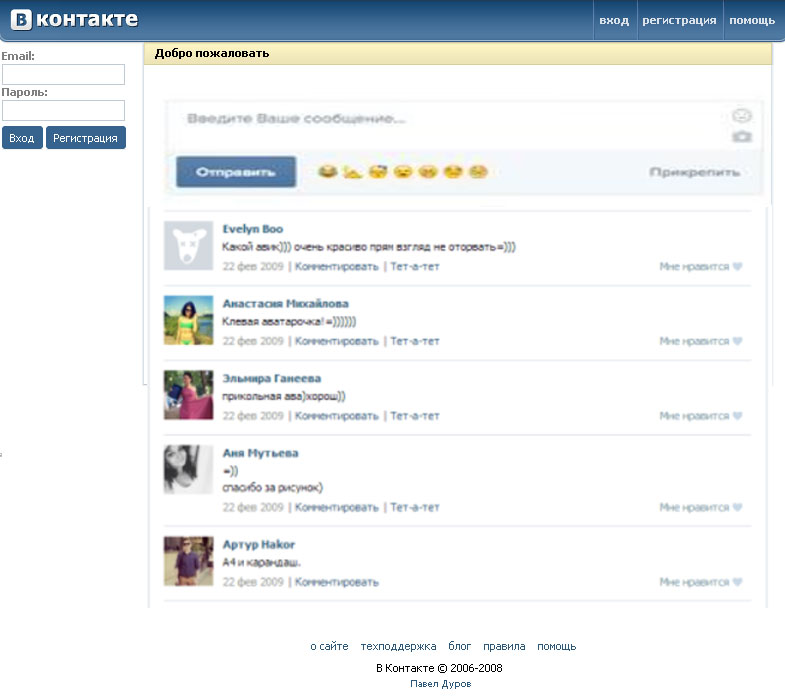

# Old VK Wall

## Цель:

Создать аналог странички с постами Вконтакте из 2009го 😉!

Цель этого задания - попрактиковаться в использовании API и создания компонентов в React.

## Название ветки: `hw-9`

Шаги выполнения домашнего задания:

1. Создайте собственный проект с помощью `Vite`, настройте его на React, JS (не TS).
2. Аналогично предыдущим дз, создайте ветку для разработки из основной (master или main). Ведите всю работу в ней, не пренебрегая коммитами.
3. Подключите `SCSS` к вашему приложению (в дальнейшем используйте только модули scss).
4. Реализуйте прилождениe.
5. Создайте pull-request в ветку `master` _своего_ репозитория и добавьте `khanmag` в качестве ревьюера (PR не нужно мержить!).
6. Ссылку на PR (pull-request) добавьте в файл [hw](https://docs.google.com/spreadsheets/d/1EZhKvZKnyOAYc0MXgYjLXoBViDUXsgVwZcqWudazcBo/edit?usp=sharing) комментарием.
## Задание:

Выше я прикрепил примерный набросок стены ВК из 2009го, который вы можете использовать в качестве справки. Функционал должен соответствовать следующим требованиям:

- Используйте [Firebase](https://firebase.google.com/) для того чтобы добавлять записи и получать записи из базы. Использовать локальные данные и localStorage - **ЗАПРЕЩЕНО! >:D**
- Посты из базы загружаются при открытии приложения, и можно тут же добавлять свои собственные. Пост должен содержать:
  - Имя пользователя
  - Дата добавления
  - Количество "лайков"
  - Аватарку пользователя (можете скачать и добавить локально [отсюда](https://randomuser.me/photos) либо [отсюда](https://www.dicebear.com/playground))
- **Не усложняйте фунционал**, весь дизайн страницы вроде синей панели сверху, формы входа слева и ссылок внизу - просто оставьте плейсхолдерами либо ссылками на настоящий **VK**. Основная задача - чтобы можно было получать посты из базы и добавлять их самостоятельно.
- _Функционал комментирования, эмодзи и Тет-а-Тет_ - добавлять **НЕ НУЖНО**.

Не забывайте следить за структурой файлов и форматированием вашего кода. Используйте соответствующие комментарии, одинаковые отступы и описательные имена компонентов и переменных.

### Дополнительно (необязательно)

- **Повторить дизайн Вконтакте 2009** - постарайтесь подойти к задаче творчески и повторить дизайн ВК из далеких 2000-ных. Лучшие работы отметим на следующем уроке и вы сможете их продемонстрировать.
- **Рандомные аватарки пользователей** - используйте **[Dicebear](https://www.dicebear.com/introduction)** либо любой другой открытый API чтобы автоматически генерировать аватарку к каждому посту!
- **Улучшение на ваше усмотрение** - если все еще чуствуете недостаток сложности - попробуйте добавить любой функционал из настоящего ВК на ваше усмотрение. Но не перетрудитесь!

## Советы:

- Помните, что имена компонентов всегда должны начинаться с заглавной буквы.
- Cоблюдайте требования к коммита - см. основной README

Удачи!
