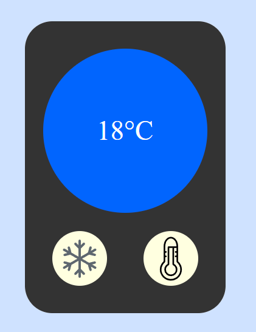

# Old VK Wall

## Цель:

Создать термометр с помощью Redux!

Цель этого задания - попрактиковаться в использовании Redux Tollkit и создания компонентов в React.

## Название ветки: `hw-10`

Шаги выполнения домашнего задания:

1. Создайте собственный проект с помощью `Vite`, настройте его на React, JS (не TS).
2. Аналогично предыдущим дз, создайте ветку для разработки из основной (master или main). Ведите всю работу в ней, не пренебрегая коммитами.
3. Подключите `SCSS` к вашему приложению (в дальнейшем используйте только модули scss).
4. Реализуйте прилождениe.
5. Создайте pull-request в ветку `master` _своего_ репозитория и добавьте `khanmag` в качестве ревьюера (PR не нужно мержить!).
6. Ссылку на PR (pull-request) добавьте в файл [hw](https://docs.google.com/spreadsheets/d/1EZhKvZKnyOAYc0MXgYjLXoBViDUXsgVwZcqWudazcBo/edit?usp=sharing) комментарием.

## Задание:

Всё очень просто, у элемента есть температура, отражающая цветовой фон всего приложения, её можно менять с помощью кнопок. Все данные отражающие состояние приложения должны храниться в redux store

## Советы:

- Помните, что имена компонентов всегда должны начинаться с заглавной буквы.
- Cоблюдайте требования к коммита - см. основной README
- Все необходимые материалы можно взять в [репозитории](https://github.com/Khanmag/webinar)

Удачи!
