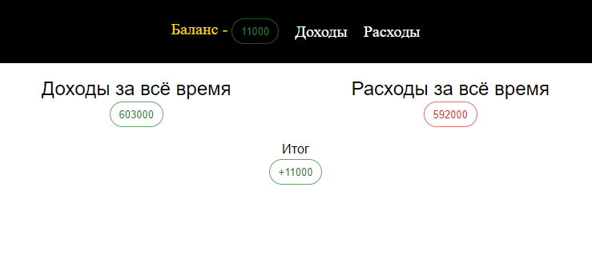
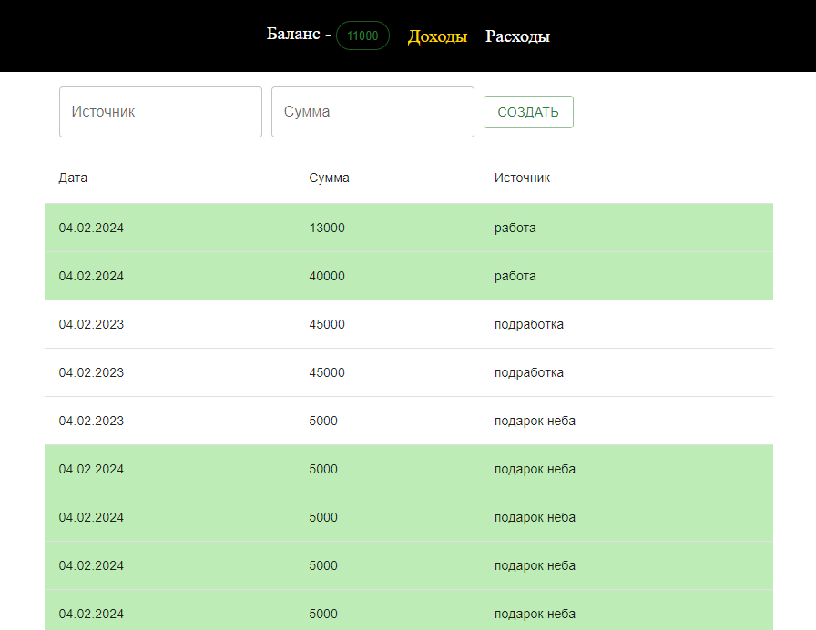
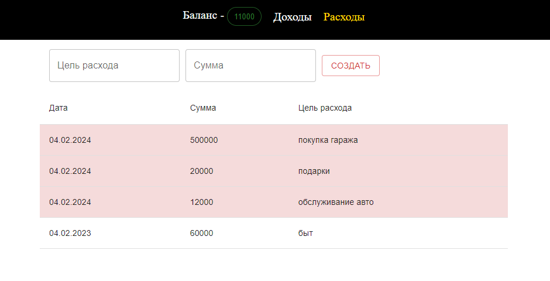

# Проект "Финансы"

## Цель: 

Разработать приложение для записи и отображения списков доходов и расходов, а так же отображения текущего баланса

## Техническое задание:

1. Проект должен быть создан с помощью vite, на TypeScript
2. Приложение содержит в себе три страницы (баланс, расходы, доходы), переключение между которыми реализовано библиотекой react-router-dom
3. На страницах Расходы и Доходы должна быть форма для создания нового элемента, под формой отображается список (таблица) со всеми ранее добавленными элементами. Создание и получение элементов осуществляется с помощью запросов к базе данных [firebase](https://console.firebase.google.com/). !Важно отметить, что при добавлении нового элемента список должен обновиться и последний добавленный элемент должен быть верхним в списке.

4. На странице Баланс отображается общая сумма расходов, общая сумма доходов и итоговый баланс.
5. Как видно на рисунке - в шапке приложения лежит баланс, он доступен в любой части приложения, реализовать такое поведение необходимо с помощью Redux

## Дополнительные пункты (не обязательные)

* На страницах Расходы и Доходы реализовать бесконеный скрол с помощью библиотеки react-intersection-observer
* На страницах Расходы и Доходы дать возможность пользователю изменять порядок показанных элементов (по дате, по сумме)
* * Запросы на сервер сделать с помощью createAsyncThunk

